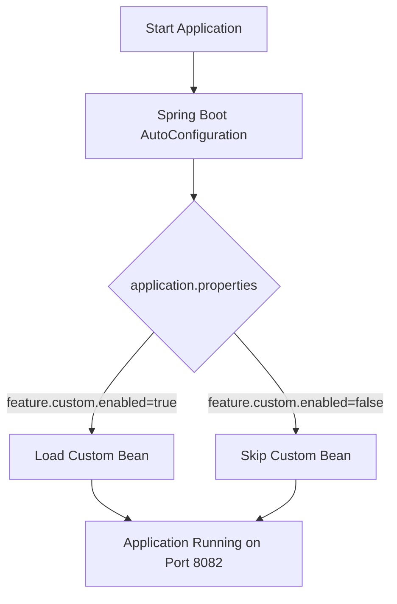

# 📌 Spring Boot AutoConfig Demo

This project demonstrates how Spring Boot AutoConfiguration works, allowing configurations to be applied automatically and overridden with custom properties.

## 🎯 Objetivos

- Demonstrar o uso de AutoConfiguration no Spring Boot.
- Criar beans condicionais com @ConditionalOnProperty.
- Mostrar como sobrescrever configurações padrão no application.properties.

## 🏗️ Estrutura do Projeto

```plaintext
spring-boot-autoconfig-demo
 ├── build.gradle.kts
 ├── settings.gradle.kts
 └── src
     ├── main
     │   ├── java/com/example/autoconfigdemo
     │   │   ├── AutoconfigDemoApplication.java
     │   │   ├── controller/GreetingController.java
     │   │   └── config/CustomAutoConfig.java
     │   └── resources/application.properties
     └── test/java/com/example/autoconfigdemo/AutoconfigDemoApplicationTests.java

```

## 🚀 Executando o Projeto

```bash

./gradlew bootRun

```

## 📊 Fluxograma – AutoConfiguration Flow




